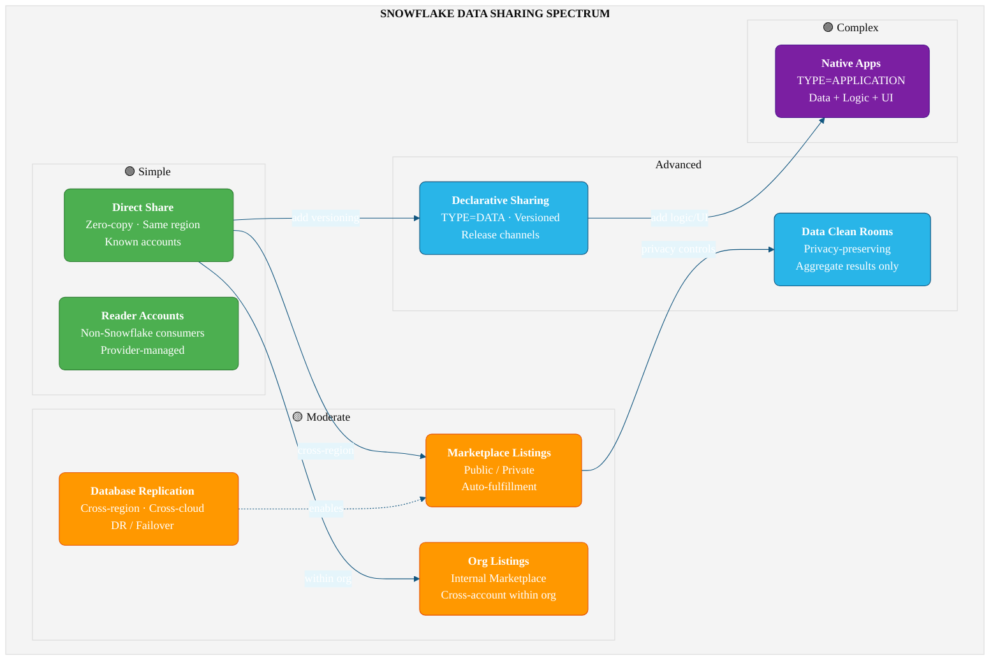
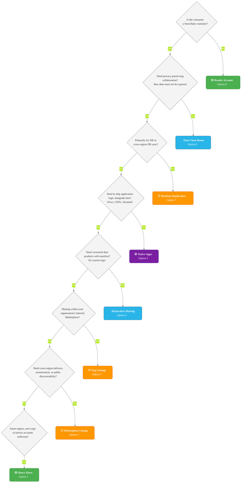

# Snowflake Data Sharing — Options & Architecture

Snowflake provides eight distinct mechanisms for sharing data across accounts, regions, and clouds. Each serves a different point on the complexity-vs-control spectrum. This reference guide summarises what each option does, when to use it, and how to choose between them.

---

## Architecture of Sharing Options



> **How to read this diagram:** Options are grouped by complexity (left → right). Arrows show
> natural migration paths — e.g., a direct share can evolve into a versioned declarative package,
> or gain cross-region reach via a marketplace listing. Database replication is the infrastructure
> layer that enables cross-region marketplace delivery.

## Comparison Matrix

| Option | Complexity | Versioning | Cross-Region | Audience | Monetisation | Data+Logic | Best For |
|---|---|---|---|---|---|---|---|
| **1. Direct Share** | Low | No | No | Known accounts, same region | No | Data only | Simple, fast zero-copy sharing |
| **2. Marketplace** | Medium | Via listings | Yes (auto-fulfillment) | Public or private, any region | Yes (paid/free/trial) | Data (or app pkg) | Broad distribution & monetisation |
| **3. Org Listings** | Medium | Via listings | Yes (auto-fulfillment) | Accounts within your org | No | Data (or app pkg) | Internal data product catalogue |
| **4. Declarative (TYPE=DATA)** | Medium | Automatic (LIVE) | Yes (auto-fulfillment) | Any Snowflake account | Via listing | Data + semantic views + agents | Versioned data products, no code |
| **5. Native Apps (TYPE=APPLICATION)** | High | Manual (versions/patches) | Yes (auto-fulfillment) | Any Snowflake account | Via listing (billable events) | Data + logic + UI | Full applications with business logic |
| **6. Data Clean Rooms** | High | N/A (templates) | Yes (auto-fulfillment) | Multi-party collaborators | No | Aggregate results only | Privacy-preserving collaboration |
| **7. DB Replication** | Medium | N/A | Yes (core purpose) | Target accounts you manage | No | Data only | DR, BC, cross-region sync |
| **8. Reader Accounts** | Low | No | Same region (Client Redirect for multi-region) | Non-Snowflake consumers | No | Data only | External users without Snowflake |

---

## 1. Direct Data Sharing (Secure Shares)

**What it is**
A zero-copy, read-only share of selected database objects (tables, views, UDFs, models) from a provider account to one or more consumer accounts in the **same region**. No data is copied or transferred — consumers query the provider's storage directly via Snowflake's services layer. Consumers pay only for the compute they use to query the shared data.

**Key SQL / API**
```sql
CREATE SHARE my_share;
GRANT USAGE ON DATABASE my_db TO SHARE my_share;
GRANT USAGE ON SCHEMA my_db.public TO SHARE my_share;
GRANT SELECT ON TABLE my_db.public.orders TO SHARE my_share;
ALTER SHARE my_share ADD ACCOUNTS = consumer_org.consumer_acct;

-- Consumer side
CREATE DATABASE shared_db FROM SHARE provider_org.provider_acct.my_share;
```

**When to use**
- Simple, low-latency data sharing between known accounts in the same region.
- Sharing raw tables or secure views without packaging or versioning requirements.
- Internal analytics teams consuming a central data platform.

**Limitations**
- Same-region only — no cross-region or cross-cloud support.
- Read-only; consumers cannot modify shared objects.
- No versioning, no metadata (title, description), no usage metrics.
- Only one database can be created per share on the consumer side.

**Cost model**
- Provider pays for storage. Consumer pays for compute (warehouses) used to query shared data. No data transfer costs (same region).

**Cross-region support**
None. For cross-region delivery, convert the direct share to a listing with auto-fulfillment, or use database replication.

---

## 2. Snowflake Marketplace

**What it is**
A public (or private) storefront where providers publish **listings** that wrap a share or application package with metadata — title, description, usage examples, terms, and optional pricing. Public listings are discoverable by any Snowflake account worldwide. Private listings target specific accounts.

**Key SQL / API**
```sql
-- Attach a share or application package to a listing via Provider Studio (Snowsight)
-- or SQL:
CREATE EXTERNAL LISTING my_listing
  APPLICATION PACKAGE my_pkg AS
$$
title: "Sales Data"
description: "Weekly sales aggregates"
listing_terms:
  type: "OFFLINE"
targets:
  accounts: ["ORG.ACCT"]
$$
PUBLISH = FALSE REVIEW = FALSE;

ALTER LISTING my_listing PUBLISH;

-- Trigger on-demand refresh
SELECT SYSTEM$TRIGGER_LISTING_REFRESH('my_listing');
```

**When to use**
- Monetising data products (free, paid, or limited-trial).
- Reaching consumers in any Snowflake region/cloud via auto-fulfillment.
- Gaining access to consumer usage metrics and engagement analytics.

**Limitations**
- Auto-fulfillment incurs compute, storage, and data-transfer costs in each remote region.
- 10 TB default size limit per auto-fulfilled database (can be raised via support).
- Trial accounts cannot use auto-fulfillment.
- Security scan required for listings distributed outside your organisation.

**Cost model**
- Provider pays for auto-fulfillment (compute, storage, egress to remote regions). Consumer pays for query compute. Paid listings allow the provider to charge consumers.

**Cross-region support**
Cross-Cloud Auto-Fulfillment replicates the data product to a Snowflake-managed Secure Share Area (SSA) in each consumer region on demand. Configurable with trigger-based, interval-based, or schedule-based refresh. Uses `SUB_DATABASE` mode by default.

---

## 3. Org Listings (Internal Marketplace)

**What it is**
Organisational listings provide a curated **Internal Marketplace** — a private directory of data products shared exclusively within your Snowflake organisation. Providers publish listings that are visible only to accounts within the same org, with access controlled by account targeting and RBAC.

**Key SQL / API**
```sql
CREATE ORGANIZATION LISTING my_org_listing
  SHARE my_share AS
$$
title: "Finance KPIs"
description: "Quarterly finance metrics for internal teams"
$$;

ALTER ORGANIZATION LISTING my_org_listing PUBLISH;
```
Also manageable via Provider Studio in Snowsight or the Snowflake API.

**When to use**
- Centralising data product discovery across business units within a single Snowflake organisation.
- Replacing legacy Data Exchanges for internal sharing.
- Ensuring internal consumers find vetted, consistent datasets before looking externally.

**Limitations**
- Organisation-scoped only — cannot share outside your Snowflake org.
- Consumers in government regions cannot discover listings via Snowsight search (must use a direct URL or SQL).
- Custom organisation profiles not supported in government regions.

**Cost model**
- Same as Marketplace listings: provider pays auto-fulfillment costs for cross-region delivery within the org; consumer pays query compute.

**Cross-region support**
Supports Cross-Cloud Auto-Fulfillment within the organisation. Auto-fulfillment triggers when a consumer in a remote region accesses the listing.

---

## 4. Declarative Sharing (Application Packages TYPE=DATA)

**What it is**
A versioned, manifest-driven way to package and share data products using the Native App Framework's `TYPE = DATA` application packages. Providers define a `manifest.yml` declaring shared objects (tables, views, semantic views, Cortex Agents, notebooks) and app roles. Versioning is automatic — no manual version tracking required.

**Key SQL / API**
```sql
CREATE APPLICATION PACKAGE my_data_pkg TYPE = DATA;

-- Upload manifest to the LIVE version stage
PUT file:///path/to/manifest.yml
    snow://package/my_data_pkg/versions/LIVE/
    OVERWRITE = TRUE AUTO_COMPRESS = FALSE;

-- Build, commit, and release in one step
ALTER APPLICATION PACKAGE my_data_pkg RELEASE LIVE VERSION;

-- Consumer installs
CREATE APPLICATION my_data_app FROM APPLICATION PACKAGE my_data_pkg;
```

**When to use**
- Sharing data products with embedded semantic views, Cortex Agents, or notebooks.
- Versioned data delivery where consumers automatically receive updates.
- Replacing direct shares when you need metadata, app roles, and cross-region delivery without writing setup scripts.

**Limitations**
- Up to 1,000 objects per application package in `shared_content`.
- Shared-by-copy objects (agents, UDFs) and shared-by-reference objects (tables, views) must be in separate schemas.
- Cannot revert consumers to a previous version.
- Cross-region auto-fulfillment requires `SUB_DATABASE_WITH_REFERENCE_USAGE` refresh type (not the older `SUB_DATABASE`).

**Cost model**
- Provider pays auto-fulfillment costs. Consumer pays query compute. No separate licensing — this is a built-in Snowflake capability.

**Cross-region support**
Supported via Cross-Cloud Auto-Fulfillment with `auto_fulfillment.refresh_type: SUB_DATABASE_WITH_REFERENCE_USAGE`.

---

## 5. Native Apps Framework (TYPE=APPLICATION)

**What it is**
The full Snowflake Native App Framework allows providers to bundle **data + application logic + UI** into a single installable application. Providers create an application package containing a `manifest.yml`, a SQL `setup_script.sql`, stored procedures, UDFs, Streamlit apps, and shared data. Consumers install the app, which runs the setup script to create objects in their account.

**Key SQL / API**
```sql
CREATE APPLICATION PACKAGE my_app_pkg;

-- Add a version from a stage
ALTER APPLICATION PACKAGE my_app_pkg
  ADD VERSION v1_0 USING '@my_stage/v1';

-- Set release directive
ALTER APPLICATION PACKAGE my_app_pkg
  SET DEFAULT RELEASE DIRECTIVE VERSION = v1_0 PATCH = 0;

-- Consumer installs
CREATE APPLICATION my_app FROM APPLICATION PACKAGE my_app_pkg;
CALL my_app.core.my_procedure();
```

**When to use**
- Delivering data **with** business logic (stored procedures, UDFs, ML models).
- Building consumer-facing UIs with embedded Streamlit.
- Monetising applications on the Snowflake Marketplace (free, paid, or trial).
- When the consumer needs to grant privileges (e.g., API integrations, warehouses) to the app.

**Limitations**
- Higher complexity — requires setup scripts, versioned schemas, and application roles.
- Stored procedures must run as OWNER (not CALLER).
- Some context functions (e.g., `CURRENT_USER`, `CURRENT_ROLE`) return NULL or throw errors inside the app.
- External functions require the consumer to provide an API integration.
- Security scan required for external distribution (can take up to 24 hours).

**Cost model**
- Provider pays for development, auto-fulfillment, and any provider-side compute. Consumer pays for compute to run the app. Providers can add billable events for custom metering on paid listings.

**Cross-region support**
Supported via Cross-Cloud Auto-Fulfillment. Application packages are auto-fulfilled to remote consumer regions. SPCS-based native apps are supported on AWS and Azure only.

---

## 6. Data Clean Rooms

**What it is**
A privacy-preserving collaboration environment where multiple parties contribute data and run pre-approved **template** queries that return only aggregate or activated results — never raw row-level data. Collaborators define roles (Owner, Data Provider, Analysis Runner), link data offerings, and submit JinjaSQL templates that control exactly what analyses are permitted.

**Key SQL / API**
```sql
-- Developer APIs (Collaboration API procedures)
CALL SAMOOHA_BY_SNOWFLAKE_LOCAL_DB.COLLABORATION.CREATE(
  $$ <collaboration_yaml_spec> $$
);

CALL SAMOOHA_BY_SNOWFLAKE_LOCAL_DB.COLLABORATION.JOIN('collab_id');

CALL SAMOOHA_BY_SNOWFLAKE_LOCAL_DB.COLLABORATION.RUN_ANALYSIS(
  'collab_id', 'template_id', { ... }
);
```
Also available via the DCR UI in Snowsight.

**When to use**
- Multi-party audience overlap, attribution, or measurement where raw data must not be exposed.
- Regulatory compliance scenarios (GDPR, CCPA) requiring aggregate-only outputs.
- Advertising / media / healthcare collaborations with strict data governance.

**Limitations**
- Requires Enterprise Edition for Data Providers (Standard Edition for Owners and Analysis Runners).
- Not available in government or VPS deployments.
- Trial accounts are not supported.
- Collaboration roles and participants are fixed after creation (resources can change).
- Cross-region collaborators must enable auto-fulfillment before joining.

**Cost model**
- The analysis runner bears the cost of query compute. Data providers pay for their own storage. Auto-fulfillment costs apply for cross-region collaborations.

**Cross-region support**
Supported. Cross-region collaborators must enable Cross-Cloud Auto-Fulfillment on their account before reviewing and joining a collaboration.

---

## 7. Database Replication

**What it is**
Asynchronous replication of databases and account objects (warehouses, users, roles, shares) from a source account to one or more target accounts in different regions or clouds. Uses **replication groups** (read-only sync) and **failover groups** (read-write promotion for DR). Designed primarily for business continuity and disaster recovery, but also enables cross-region data sharing.

**Key SQL / API**
```sql
-- Source account: create a replication group
CREATE REPLICATION GROUP my_rg
  OBJECT_TYPES = DATABASES, ROLES, SHARES
  ALLOWED_DATABASES = my_db
  ALLOWED_SHARES = my_share
  ALLOWED_ACCOUNTS = my_org.target_acct
  REPLICATION_SCHEDULE = '10 MINUTE';

-- Target account: create secondary replica
CREATE REPLICATION GROUP my_rg
  AS REPLICA OF my_org.source_acct.my_rg;

-- Manual refresh
ALTER REPLICATION GROUP my_rg REFRESH;

-- Failover (Business Critical+)
ALTER FAILOVER GROUP my_fg PRIMARY;
```

**When to use**
- Disaster recovery and business continuity across regions/clouds.
- Sharing data cross-region when you need full control over replication schedule and failover.
- Migrating a Snowflake account to a different region or cloud.

**Limitations**
- Failover and replication of non-database objects (users, roles, warehouses) require Business Critical edition or higher.
- Asynchronous — secondary replicas can lag up to 2× the replication interval.
- Requires managing replication groups and target accounts manually.
- Not designed for wide-scale consumer distribution (use listings/auto-fulfillment for that).

**Cost model**
- Provider (source) pays for compute to replicate, data-transfer egress, and storage in the target region. Target account pays for query compute on secondary replicas.

**Cross-region support**
Core purpose. Supports replication across any Snowflake region and cloud platform. Configurable replication schedules from 1 minute up.

---

## 8. Reader Accounts

**What it is**
Provider-managed Snowflake accounts created for consumers who are **not** existing Snowflake customers. The provider creates the reader account, shares data via standard shares, and bears all credit costs. Reader accounts can only consume data from the provider that created them.

**Key SQL / API**
```sql
CREATE MANAGED ACCOUNT reader_acct1
  ADMIN_NAME = admin_user,
  ADMIN_PASSWORD = 'SecurePass123!',
  TYPE = READER;

-- Add reader account to a share
ALTER SHARE my_share ADD ACCOUNTS = reader_acct1;

-- View reader accounts
SHOW MANAGED ACCOUNTS;

-- Drop
DROP MANAGED ACCOUNT reader_acct1;
```

**When to use**
- Sharing data with external partners or customers who do not have Snowflake accounts.
- Quick, low-friction access for non-Snowflake consumers who only need to query data.
- Controlled environments where the provider manages all costs and access.

**Limitations**
- Read-only: no data loading, no INSERT/UPDATE/DELETE/MERGE, no stages, no pipes.
- Can only consume data from the single provider account that created it.
- Default limit of 20 reader accounts per provider (raise via Snowflake Support).
- Provider pays all compute costs — use resource monitors to control spending.
- Same Snowflake edition and region as the provider account.
- No Snowflake Support for reader account users — provider must field all support.

**Cost model**
- Provider pays for everything: storage, compute (warehouses in reader account), and any resource usage. Consumer pays nothing.

**Cross-region support**
Reader accounts are created in the same region as the provider. For cross-region reader access, use Client Redirect with reader accounts in multiple regions (requires Business Critical edition).

---

## Decision Tree


