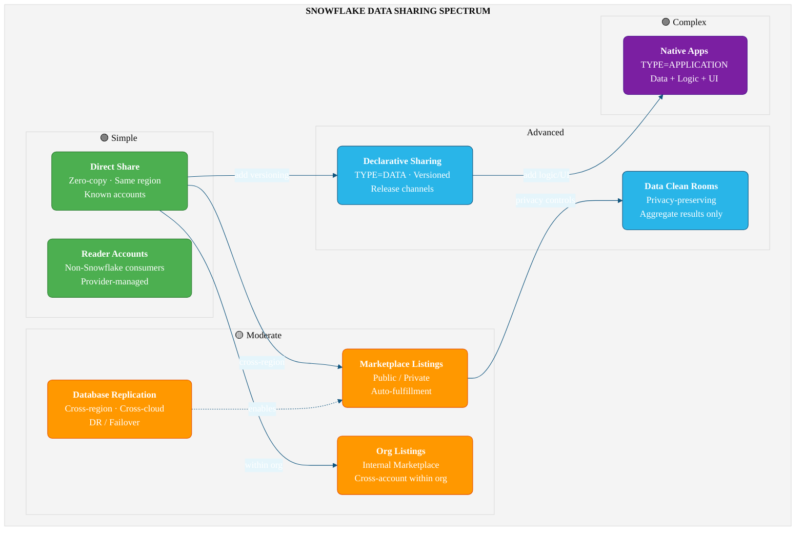

# Snowflake Data Sharing — Specification & Agent Build Prompt

> **Purpose:** Agent-optimised specification for building a comprehensive Snowflake Data Sharing guide with interactive notebook examples. Each phase is self-contained and can be executed independently by a specialised agent.

---

## System Prompt for Build Agents

```
You are a Snowflake Solutions Architect agent building production-ready data sharing
documentation and interactive notebooks. You MUST:

1. Ground ALL SQL, API references, and architecture claims on official Snowflake documentation
   (use snowflake_product_docs to verify before writing)
2. Use uppercase SQL keywords, snake_case identifiers
3. Follow least-privilege RBAC patterns throughout
4. Create notebooks that are independently executable in Snowflake Workspaces
5. If uncertain about any claim, surface it as an open question — never guess
6. Use the SNOWFLAKE_SAMPLE_DATA database where possible for examples
7. Validate all SQL with only_compile=true before including in deliverables
```

---

## Requirements Traceability

| # | Requirement | Deliverable | Phase |
|---|-------------|-------------|-------|
| R1 | Summary of data sharing options and architecture | `01_overview.md` | 1 |
| R2 | Security, networking, data governance, RBAC considerations | `02_security_governance.md` | 2 |
| R3 | Deep dive per option with clear, concise examples | `notebooks/03_*.ipynb` (one per option) | 3 |
| R4 | Examples grounded on official Snowflake documentation | All phases — verify via `snowflake_product_docs` | All |
| R5 | Examples executable independently in Workspaces/Notebooks | Each notebook is self-contained with setup + teardown | 3 |
| R6 | Best practices: naming conventions, RBAC, least privilege | Embedded in all deliverables | All |

---

## Architecture of Sharing Options



---

## Phase 1 — Overview & Architecture (`01_overview.md`)

**Agent instruction:** Create a markdown document covering ALL Snowflake data sharing options.

### Content structure:

#### 1.1 Direct Data Sharing (Secure Shares)
- **What:** Provider creates a share object containing references to database objects. Consumer accesses data in-place with zero copy.
- **Key SQL:** `CREATE SHARE`, `GRANT ... TO SHARE`, `ALTER SHARE ADD ACCOUNTS`, `CREATE DATABASE FROM SHARE`
- **When to use:** Same-region, known accounts, simple read-only data feeds
- **Limitations:** Same-region only (cross-region needs replication or listings), no versioning, read-only for consumers, no code/logic sharing
- **Cost model:** Provider pays storage; consumer pays compute; same-region transfer is free

#### 1.2 Snowflake Marketplace (Public & Private Listings)
- **What:** Discovery/distribution platform in Snowsight. Listings can be free or paid, public or personalized (private).
- **When to use:** Data monetisation, public datasets, cross-region distribution (auto-fulfillment)
- **Limitations:** Provider must accept Provider Terms; Snowflake reviews public listings
- **Cost model:** Auto-fulfillment cross-region replication costs borne by provider

#### 1.3 Org Listings (Internal Marketplace)
- **What:** Private listings scoped to accounts within the same Snowflake organization
- **When to use:** Enterprise data mesh, centralized data team distributing curated datasets, replacing legacy data exchanges
- **Limitations:** All accounts must be in same organization; not for external sharing

#### 1.4 Declarative Sharing (Application Packages TYPE=DATA)
- **What:** YAML-driven approach wrapping data into versioned application packages
- **Key SQL:** `CREATE APPLICATION PACKAGE ... TYPE = DATA`, `ADD VERSION`, release directives
- **When to use:** Versioned data products, controlled rollouts, modern replacement for direct shares
- **Limitations:** Cannot include stored procedures/Streamlit (use TYPE=APPLICATION for that)

#### 1.5 Native Apps Framework (TYPE=APPLICATION)
- **What:** Full application packages with data + logic + UI (stored procs, UDFs, Streamlit, SPCS containers)
- **When to use:** Data products with embedded analytics, SaaS apps in consumer's Snowflake, ML model distribution
- **Limitations:** Most complex option; consumer must approve privilege requests

#### 1.6 Data Clean Rooms
- **What:** Privacy-preserving collaboration — multiple parties analyse combined data without exposing raw data
- **When to use:** Advertising overlap, healthcare research, fraud detection, any scenario where raw data must not leave owner's control
- **Limitations:** Only approved analysis templates; not general-purpose data access

#### 1.7 Database Replication
- **What:** Copy and synchronise databases across regions/clouds. Foundation for cross-region sharing and DR.
- **Key SQL:** `CREATE REPLICATION GROUP`, `CREATE FAILOVER GROUP`
- **When to use:** Cross-region data sharing, DR/BC, data locality compliance

#### 1.8 Reader Accounts
- **What:** Managed accounts for sharing with non-Snowflake customers
- **Key SQL:** `CREATE MANAGED ACCOUNT ... TYPE = READER`
- **When to use:** Sharing with partners who don't have Snowflake
- **Limitations:** Provider pays all compute; max 20 accounts (default); reader accounts cannot load data or create shares

### Decision Tree
Include the following decision logic:
1. Sharing within same org? → **Org Listings**
2. Need data + logic? → **Native Apps**
3. Privacy-preserving (no raw data exposure)? → **Data Clean Rooms**
4. Cross-region distribution? → **Marketplace Listings** (auto-fulfillment)
5. Versioned data releases? → **Declarative Sharing (TYPE=DATA)**
6. Simple same-region, known accounts? → **Direct Share**
7. Data monetisation? → **Marketplace** (paid listings)
8. Non-Snowflake consumers? → **Reader Accounts**

### Comparison Matrix
Include a table comparing: complexity, versioning, cross-region support, audience scope, monetisation, data+logic, recommended use case.

---

## Phase 2 — Security, Governance & Best Practices (`02_security_governance.md`)

**Agent instruction:** Create a markdown document covering all security, networking, governance, and RBAC considerations for data sharing.

### Content structure:

#### 2.1 RBAC Hierarchy (Least Privilege)

**Provider-side roles:**
```
ACCOUNTADMIN
    └── SYSADMIN
          ├── SHARE_ADMIN (CREATE SHARE, MANAGE SHARE TARGET)
          ├── LISTING_ADMIN (CREATE DATA EXCHANGE LISTING)
          └── SHARE_MONITOR (read-only monitoring via ACCOUNT_USAGE)
```

**Consumer-side roles:**
```
ACCOUNTADMIN
    └── SYSADMIN
          └── SHARE_IMPORTER (IMPORT SHARE, CREATE DATABASE)
                └── SHARED_DATA_READER (SELECT on shared objects)
```

Include complete SQL for role creation, hierarchy grants, and privilege assignments.

#### 2.2 Secure Views & Secure UDFs
- Why mandatory for shares (`SECURE_OBJECTS_ONLY=TRUE` default)
- Using `CURRENT_ACCOUNT()` for per-consumer filtering
- Testing with `SIMULATED_DATA_SHARING_CONSUMER`

#### 2.3 Database Roles in Shares
- Granular access segmentation within a single share
- SQL pattern: create database role → grant objects → grant database role to share
- Consumer mapping: grant shared database role to local roles

#### 2.4 Row Access Policies
- Must use `IS_DATABASE_ROLE_IN_SESSION()` (not `CURRENT_ROLE()` — returns NULL in consumer context)
- Mapping tables must be in same database as protected table
- Enterprise Edition+ required

#### 2.5 Masking Policies
- Same pattern as row access: `IS_DATABASE_ROLE_IN_SESSION()` in policy body
- External tokenisation NOT supported with shares
- Tag-based masking with automatic application

#### 2.6 Network Security & Private Connectivity
- AWS PrivateLink / Azure Private Link / GCP Private Service Connect
- Network policies restricting shared data access
- Enforce private-only access: `SYSTEM$ENFORCE_PRIVATELINK_ACCESS_ONLY()`

#### 2.7 Cross-Region & Cross-Cloud
- Auto-fulfillment for listings (provider enables; Snowflake manages SSAs)
- `SUB_DATABASE` mode to replicate only shared objects (cost optimisation)
- Refresh options: trigger, interval, cron schedule
- `REFERENCE_USAGE` for cross-database views in shares

#### 2.8 Audit & Monitoring
- `DATA_SHARING_USAGE.LISTING_ACCESS_HISTORY` — consumer query tracking
- `ACCOUNT_USAGE.ACCESS_HISTORY` — column-level audit (Enterprise+)
- `REPLICATION_USAGE_HISTORY` — cross-region replication costs
- Alert example for inactive consumers

#### 2.9 Naming Conventions
| Object | Pattern | Example |
|--------|---------|---------|
| Share | `<COMPANY>_<DATASET>_<AUDIENCE>_SHARE` | `ACME_SALES_PARTNER_SHARE` |
| Consumer DB | `<PROVIDER>_<DATASET>_DB` | `ACME_SALES_DB` |
| Shared schema | `SHARED_<DOMAIN>` | `SHARED_ANALYTICS` |
| Provider roles | `SHARE_ADMIN`, `LISTING_ADMIN`, `SHARE_MONITOR` | — |
| Consumer roles | `SHARE_IMPORTER`, `SHARED_DATA_READER` | — |

#### 2.10 Cost Model Summary
| Component | Provider Pays | Consumer Pays |
|-----------|--------------|---------------|
| Storage of shared data | Yes | No (zero-copy) |
| Compute for queries | No | Yes |
| Same-region transfer | Free | Free |
| Cross-region replication | Yes | No |
| Reader account compute | Yes | N/A |
| Marketplace platform fee | Yes (if applicable) | No |

---

## Phase 3 — Interactive Notebook Deep Dives

**Agent instruction:** Create one self-contained Snowflake notebook per sharing option. Each notebook MUST:

1. Start with a markdown cell explaining the sharing option
2. Include a setup section creating required objects (database, schema, roles, sample data)
3. Use `SNOWFLAKE_SAMPLE_DATA` as the source where possible
4. Include RBAC setup following least-privilege patterns
5. Demonstrate the sharing workflow end-to-end
6. Include monitoring/verification queries
7. End with a teardown section (`DROP` all created objects)
8. Be executable independently — no dependencies on other notebooks

### Notebook 3A — Direct Data Sharing (`notebooks/03a_direct_sharing.ipynb`)

**Sections:**
1. Markdown: Overview of direct sharing
2. SQL: Create demo database, schema, roles (`SHARE_ADMIN`, `SHARE_MONITOR`)
3. SQL: Create sample data from `SNOWFLAKE_SAMPLE_DATA.TPCH_SF1`
4. SQL: Create secure view with `CURRENT_ACCOUNT()` filtering
5. SQL: Create share, grant objects, describe share
6. SQL: Add consumer account (parameterised — user provides account identifier)
7. SQL: Verify with `SHOW GRANTS TO SHARE`, `DESCRIBE SHARE`
8. SQL: Monitor with sharing usage views
9. SQL: Teardown — drop share, roles, schema, database

### Notebook 3B — Marketplace Listings (`notebooks/03b_marketplace_listings.ipynb`)

**Sections:**
1. Markdown: Marketplace overview (public vs personalized listings)
2. SQL: Create provider data objects and secure views
3. SQL: Create share for listing foundation
4. Markdown: Step-by-step Snowsight UI walkthrough (with instructions for Provider Studio)
5. SQL: Monitor listing telemetry (`LISTING_TELEMETRY_DAILY`, `LISTING_ACCESS_HISTORY`)
6. SQL: Auto-fulfillment configuration and cross-region monitoring
7. SQL: Teardown

### Notebook 3C — Org Listings / Internal Marketplace (`notebooks/03c_org_listings.ipynb`)

**Sections:**
1. Markdown: Internal marketplace overview
2. SQL: Create shareable dataset with RBAC
3. SQL: Create share for org listing
4. Markdown: Snowsight walkthrough for creating an org listing
5. SQL: Verify listing visibility within organization
6. SQL: Consumer-side installation and access granting
7. SQL: Teardown

### Notebook 3D — Declarative Sharing (`notebooks/03d_declarative_sharing.ipynb`)

**Sections:**
1. Markdown: Declarative sharing (TYPE=DATA) overview
2. SQL: Create source database and secure views
3. SQL: `CREATE APPLICATION PACKAGE ... TYPE = DATA`
4. SQL: Create manifest.yml and setup.sql on stage
5. SQL: Add version, set release directive
6. SQL: Verify package contents
7. Markdown: How to create a listing from this package
8. SQL: Teardown — drop application package, stage, database

### Notebook 3E — Native Apps Framework (`notebooks/03e_native_apps.ipynb`)

**Sections:**
1. Markdown: Native Apps overview
2. SQL: Create application package (TYPE=APPLICATION)
3. SQL: Write manifest.yml, setup_script.sql, README.md to stage
4. SQL: Add version from stage
5. SQL: Install application locally for testing
6. SQL: Grant privileges to application, verify functionality
7. Markdown: Marketplace publishing workflow
8. SQL: Teardown

### Notebook 3F — Data Clean Rooms (`notebooks/03f_clean_rooms.ipynb`)

**Sections:**
1. Markdown: Clean rooms overview and privacy-preserving collaboration
2. SQL: Create provider dataset (simulated advertiser data)
3. SQL: Create consumer dataset (simulated publisher data)
4. Markdown: DCR API walkthrough — creating collaboration, templates, running analysis
5. SQL: Overlap analysis example
6. SQL: Teardown

### Notebook 3G — Database Replication (`notebooks/03g_replication.ipynb`)

**Sections:**
1. Markdown: Replication architecture and use cases
2. SQL: Create source database with sample data
3. SQL: `CREATE REPLICATION GROUP` with schedule
4. SQL: Monitor replication status and costs
5. SQL: Failover group configuration
6. SQL: Teardown — drop replication group, database

### Notebook 3H — Security & Governance Deep Dive (`notebooks/03h_security_governance.ipynb`)

**Sections:**
1. Markdown: Security patterns for shared data
2. SQL: Create RBAC hierarchy (provider + consumer roles)
3. SQL: Create secure views with per-account filtering
4. SQL: Row access policy with `IS_DATABASE_ROLE_IN_SESSION()`
5. SQL: Masking policy with database role context
6. SQL: Database roles in shares — granular segmentation
7. SQL: Test with `SIMULATED_DATA_SHARING_CONSUMER`
8. SQL: Audit queries (`ACCESS_HISTORY`, `LISTING_ACCESS_HISTORY`)
9. SQL: Teardown

---

## Phase 4 — Validation & Verification

**Agent instruction:** Validate all deliverables.

### Checks:
1. **SQL compilation:** Run every SQL block with `only_compile=true` to verify syntax
2. **Documentation grounding:** Cross-reference all claims against `snowflake_product_docs`
3. **Notebook independence:** Verify each notebook has complete setup + teardown
4. **RBAC completeness:** Verify every example uses least-privilege roles (not ACCOUNTADMIN for data operations)
5. **Naming conventions:** Verify all objects follow the naming patterns in §2.9
6. **No hardcoded credentials:** Scan all files for secrets, account URLs, passwords
7. **Cross-references:** Verify all inter-document links resolve correctly

---

## File Structure

```
snow-datasharing/
├── requirements.md                    # Original requirements
├── specification.md                   # This file
├── 01_overview.md                     # Sharing options overview & architecture
├── 02_security_governance.md          # Security, RBAC & governance guide
└── notebooks/
    ├── 03_direct_sharing.ipynb        # Direct sharing (secure shares)
    ├── 04_marketplace_listings.ipynb   # Marketplace listings
    ├── 05_org_listings.ipynb           # Org listings (internal marketplace)
    ├── 06_declarative_sharing.ipynb    # Declarative sharing (TYPE=DATA)
    ├── 07_native_apps.ipynb            # Native apps framework
    ├── 08_clean_rooms.ipynb            # Data clean rooms
    ├── 09_replication.ipynb            # Database replication
    └── 10_security_governance.ipynb    # Security & governance deep dive
```

---

## Open Questions (Surface to User)

1. **Target Snowflake Edition:** Some features (row access policies, masking, ACCESS_HISTORY) require Enterprise+; PrivateLink requires Business Critical+. Which edition should examples target?
2. **Cross-account testing:** Direct sharing and replication examples require a second Snowflake account. Should we parameterise consumer account identifiers, or create reader accounts for self-contained demos?
3. **Data Clean Rooms:** The DCR API is a managed service — should the notebook include simulated examples (overlap analysis via SQL) or reference the DCR UI workflow?
4. **Marketplace listings:** Creating actual listings requires Provider Terms acceptance. Should the notebook walk through UI steps as markdown instructions, or attempt programmatic listing creation?
5. **Scope of Native Apps example:** Full native app development is extensive. Should the example be minimal (data + secure view + basic setup script) or include Streamlit UI?

---

## Execution Order

| Phase | Deliverable | Dependencies | Estimated Effort |
|-------|-------------|-------------|-----------------|
| 1 | `01_overview.md` | None | Medium |
| 2 | `02_security_governance.md` | Phase 1 (for consistency) | Medium |
| 3 | `03_direct_sharing.ipynb` | Phase 2 (RBAC patterns) | Low |
| 4 | `04_marketplace_listings.ipynb` | Phase 3 | Medium |
| 5 | `05_org_listings.ipynb` | Phase 3 | Low |
| 6 | `06_declarative_sharing.ipynb` | Phase 3 | Medium |
| 7 | `07_native_apps.ipynb` | Phase 6 | High |
| 8 | `08_clean_rooms.ipynb` | None | Medium |
| 9 | `09_replication.ipynb` | None | Low |
| 10 | `10_security_governance.ipynb` | Phase 2 | Medium |
| 11 | Validation pass | All phases | Low |

Notebooks 03-10 can be parallelised across multiple agents after Phases 1-2 complete.
